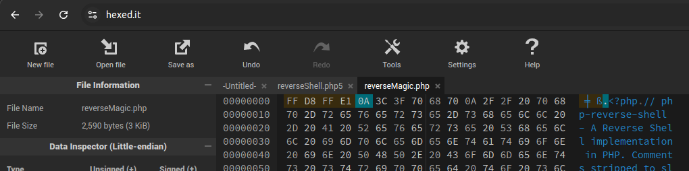

# 1337UP LIVE CTF - Fruitables  
## Challenge Information
- **Category:** Web
- **Difficulty:** Medium


### Challenge Walkthrough


I started by running a Gobuster scan while exploring the site manually.


The scan revealed `/auth` and `/uploads` directories, though both returned 403 Forbidden errors.
Running another scan specifically for PHP files revealed an accessible `/account.php`.
This led me to the login page at:

https://fruitables-2.ctf.intigriti.io/auth/fruitables_login.php

### SQL Injection Discovery
When testing the username field with `admin'`, I received the following SQL error:


This confirmed the possibility of SQL injection. I proceeded with SQLMap for automated exploitation.
With help from [this resource](https://acorzo1983.github.io/SQLMapCG/) and ChatGPT, I crafted the following SQLMap command:

```bash
sudo sqlmap -u "https://fruitables-2.ctf.intigriti.io/auth/fruitables_login.php" --data="username=admin&password=admin" --dump
```


### Password Cracking
I attempted to crack the admin account (tjfry_admin) hash using John the Ripper:


Successfully obtained credentials:
```json
Username: tjfry_admin
Password: futurama
```

### File Upload Vulnerability
After logging in, I discovered a file upload functionality.
I attempted to upload a PHP reverse shell ([pentestmonkey-php](https://github.com/pentestmonkey/php-reverse-shell/blob/master/php-reverse-shell.php))
The site only allowed jpeg and gif files.


#### Failed Bypass Attempts
- Double extension (.php.jpg)
- MIME type manipulation (Intercepting request and changing application/x-php to image/jpeg)
- Alternative PHP extensions (php3, php4, phtml...)

#### Successful Bypass - Magic Number Manipulation

Magic numbers are specific bytes at the beginning of a file that identify its type. Operating systems and software use these to recognize file formats regardless of their extension.

I modified the PHP file by adding 4 characters at the beginning to accommodate a magic number:

##### File Before Modification

##### File After Modification


The modified file was successfully uploaded with a .php extension.


### Reverse Shell Exploitation
A reverse shell allows an attacker to establish a connection from the target machine back to the attacker's system, enabling remote control.

Using the information from the initial scan about the uploads directory, I set up a netcat listener on port 1234:
```bash
nc -lvnp 1234
```

Successfully obtained the flag:
