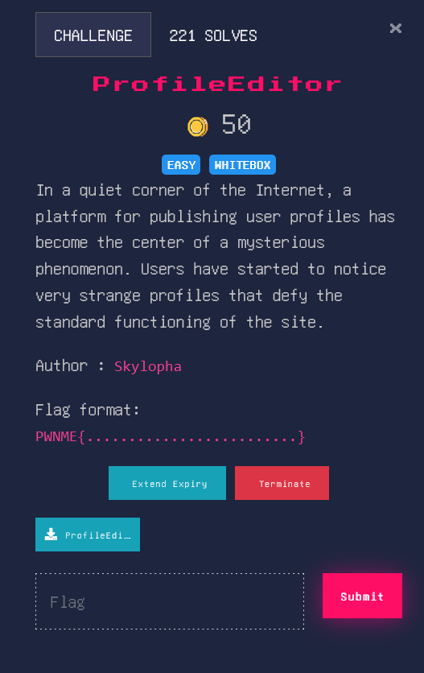
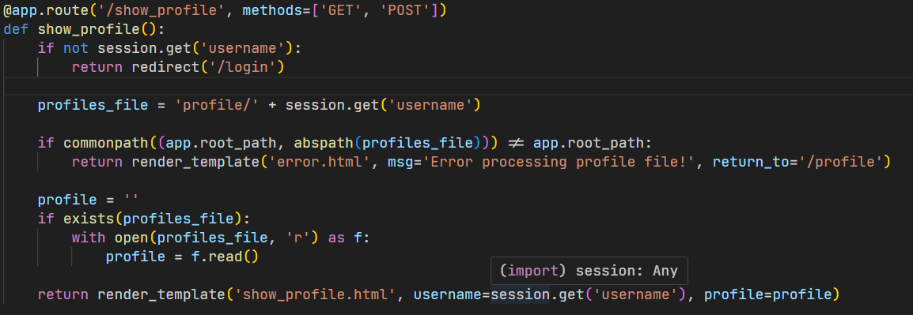
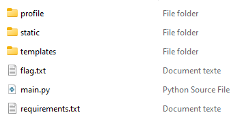
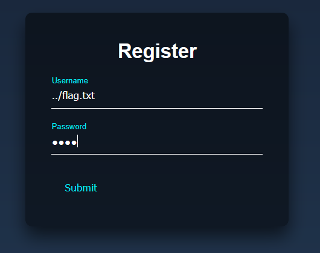
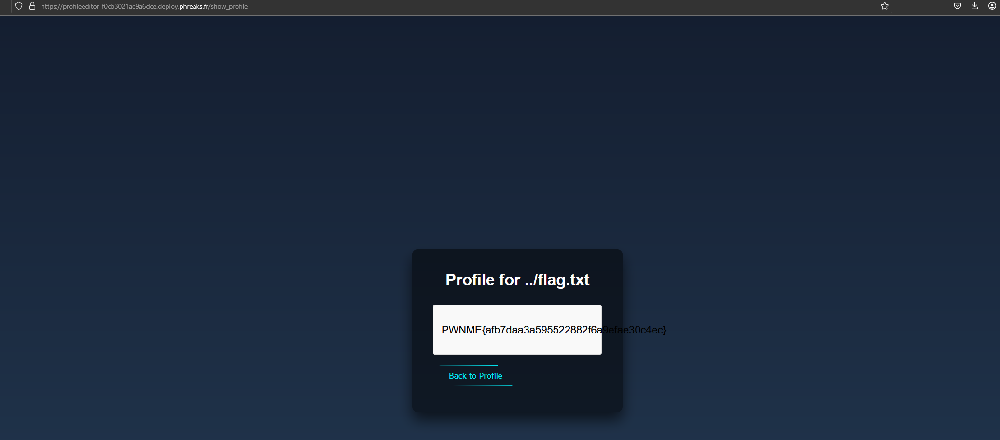

# PwnMe CTF - Profile Editor

## Challenge Information
- **Category:** Web
- **Difficulty:** Easy

## Description

## Code Analysis
Upon examining the provided Python file, we identified potentially vulnerable code that could be exploited:

The code appears to have a weakness in how it handles user input, specifically in the profile viewing functionality.

## File Structure

## Solution
The vulnerability lies in the path traversal attack vector. By analyzing the code, we can see that the application doesn't properly sanitize the username input when accessing profiles.

### Exploitation Steps:
1. **Initial Access**
   - Username: `../flag.txt`
   - Password: `1234`

2. **Proof of Concept**
   

3. **Flag Retrieval**
   - After successful login, accessed the `/show_profile` endpoint
   - The path traversal vulnerability allowed us to read the flag.txt file

## Flag

## Key Takeaways
- The application was vulnerable to path traversal due to improper input sanitization
- Directory traversal using `../` allowed access to files outside the intended directory
- Always implement proper input validation and sanitization in web applications